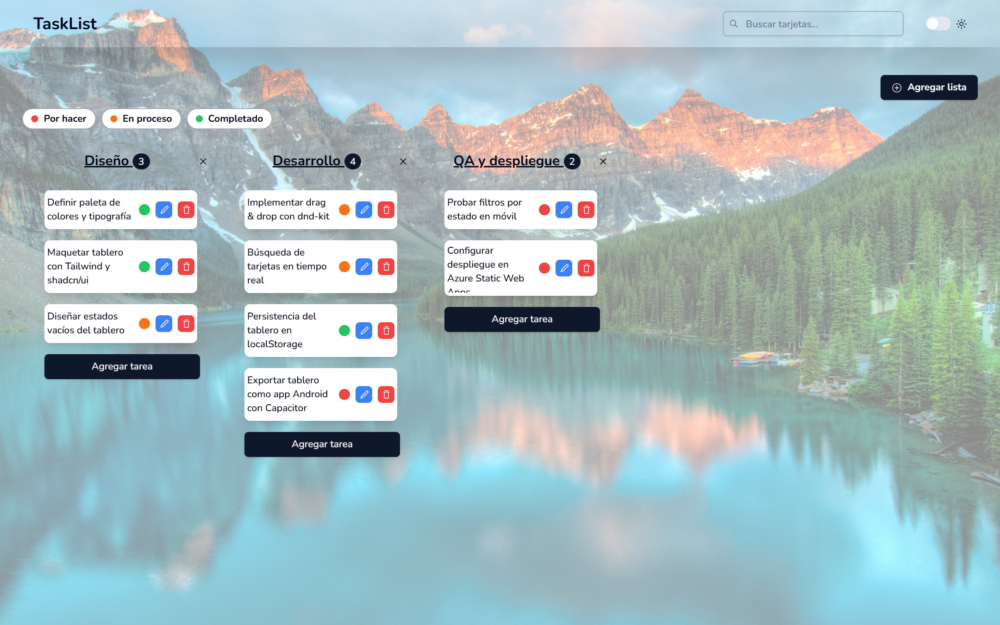
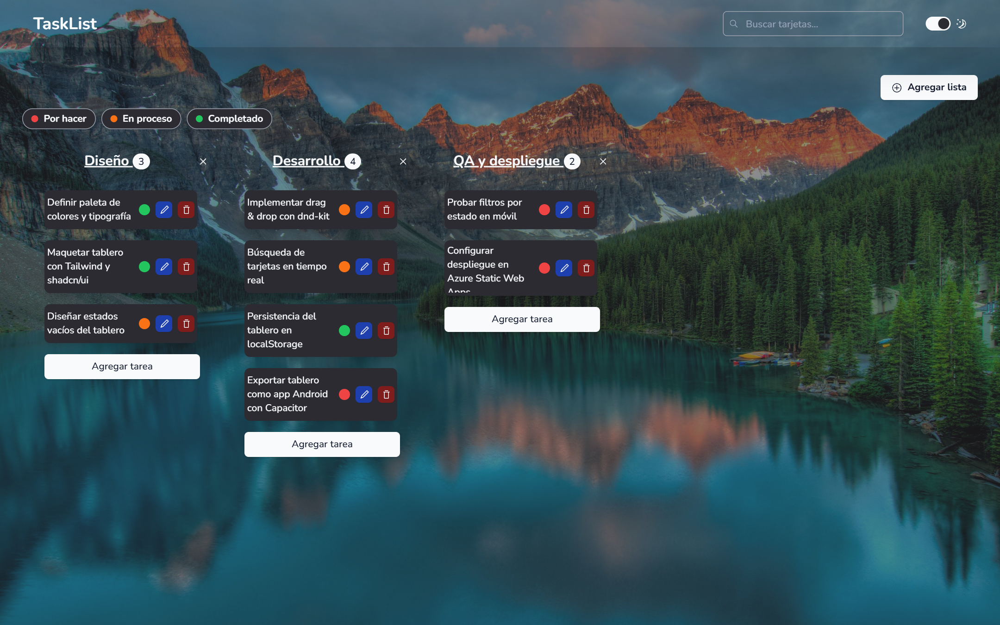
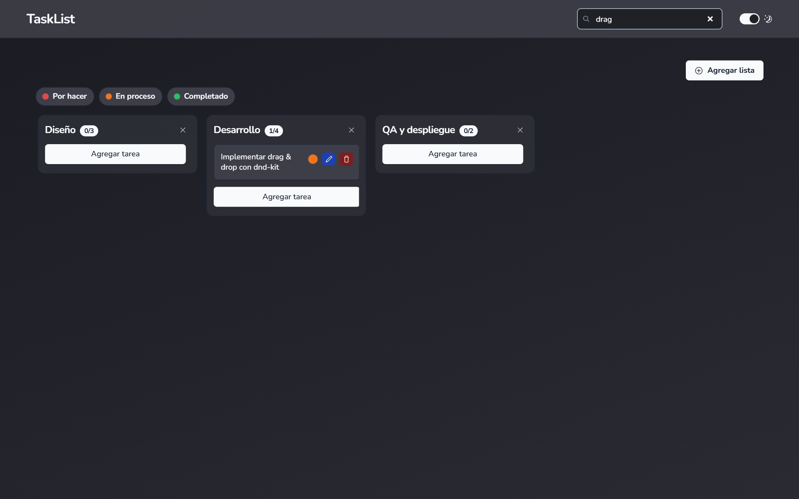
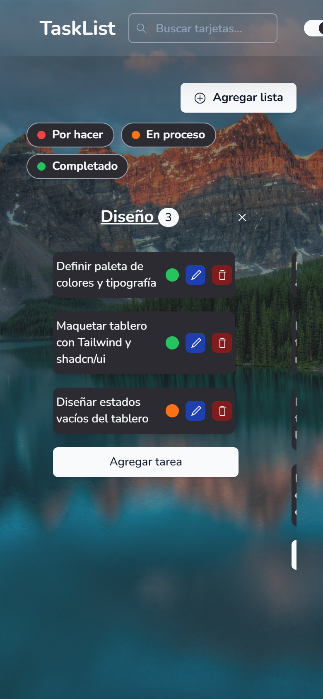
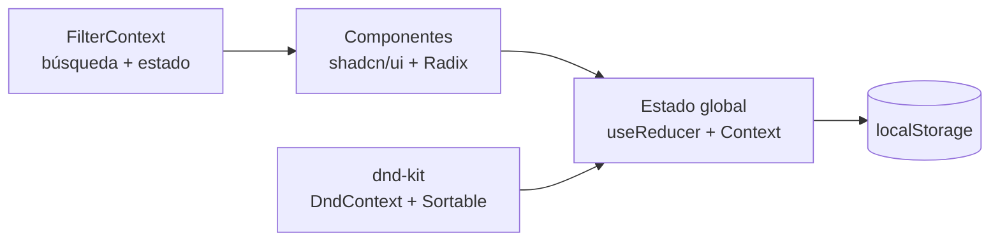

# TaskList — Tablero Kanban tipo Trello

<p align="center">
  
</p>

<p align="center">
  
  
  
  
  
  
</p>

Tablero Kanban inspirado en Trello construido con **Next.js 14 (App Router)** y exportado como **sitio 100% estático**: sin backend, con persistencia en `localStorage`, **drag & drop**, búsqueda en tiempo real, filtros por estado, modo claro/oscuro y build nativo Android vía **Capacitor**.

## Funcionalidades

- **Drag & drop** con [@dnd-kit](https://dndkit.com/): reordenar tarjetas dentro de una lista y moverlas entre listas, con overlay visual al arrastrar y soporte de teclado.
- **Búsqueda en tiempo real** desde la barra superior, que filtra las tarjetas de todo el tablero.
- **Filtros por estado** (Por hacer / En proceso / Completado) con chips y **contador `visibles/total`** en cada lista.
- **Semáforo de estado** por tarjeta, cambiable desde un menú radio.
- CRUD completo de listas y tarjetas con validación (zod + react-hook-form) y confirmaciones de borrado.
- **Modo claro/oscuro** con next-themes.
- **Persistencia automática** en `localStorage` (con migración de datos de versiones anteriores).
- **App Android** generada con Capacitor a partir del export estático.
- **CI/CD** a Azure Static Web Apps con GitHub Actions.

## Interfaces

| Modo oscuro | Búsqueda filtrando en vivo |
|---|---|
|  |  |

<p align="center">
  
</p>

## Arquitectura



- **Estado**: `useReducer` + Context API propios (sin librerías de estado externas). El drag & drop aplica el nuevo orden mediante la acción `REPLACE` y un `useEffect` persiste cada cambio.
- **Filtros**: contexto separado (`FilterContext`) porque el buscador vive en el layout y el tablero en la página; el filtrado es 100% derivado y no altera los datos guardados.
- **IDs**: `crypto.randomUUID()` (con normalización de IDs numéricos antiguos al cargar).

## Decisiones de interfaz

- **Fondo sobrio en lugar de fotografía.** El tablero usaba una foto de paisaje a pantalla completa con `opacity-45`: competía visualmente con las tarjetas y hacía que el contraste del texto dependiera de la zona de la imagen que quedara detrás. Se sustituyó por un degradado lineal construido con tokens del tema (`--app-gradient-from` / `--app-gradient-to`), distinto en claro y en oscuro. Así el contraste es predecible y medible, y el archivo de imagen deja de viajar en el bundle estático.
- **Tres superficies, no una.** Fondo (degradado) para la página, `--panel` para la columna de cada lista y `--card` para la tarjeta. En modo oscuro la tarjeta es más clara que el panel y el panel más claro que el fondo, de modo que la jerarquía se lee sin depender de la sombra.
- **Texto de tarjeta sin cortes feos.** Antes la tarjeta tenía alto máximo fijo y el texto se recortaba a media línea. Ahora la tarjeta crece con su contenido, el texto parte por palabra (`break-words`) y solo las descripciones muy largas se limitan con `line-clamp`, que corta en un salto de línea; el texto completo queda accesible en el `title`.
- **Contraste AA verificado** en ambos temas para texto y controles: texto de tarjeta 19.8:1 en claro y 10.1:1 en oscuro, texto sobre panel por encima de 6:1 en ambos, y todos los controles con estado `hover` y `focus-visible` explícito.

## Ejecución local

```bash
git clone https://github.com/danielyatacoblas/trello-clone.git
cd trello-clone
npm install
npm run dev      # http://localhost:3000
```

No requiere variables de entorno ni servicios externos.

### Build y Android

```bash
npm run build    # export estático en /out
npx cap sync     # sincroniza con el proyecto Android
npx cap open android
```

## Stack

| Capa | Tecnología |
|---|---|
| Framework | Next.js 14 App Router (`output: 'export'`) + React 18 |
| Lenguaje | TypeScript |
| UI | Tailwind CSS + shadcn/ui (Radix UI) + next-themes |
| Drag & drop | @dnd-kit/core + @dnd-kit/sortable |
| Formularios | react-hook-form + zod |
| Móvil | Capacitor 6 (Android) |
| CI/CD | GitHub Actions a Azure Static Web Apps |

## Autor

**Daniel Yataco Blas** — [GitHub](https://github.com/danielyatacoblas)

## Licencia

Proyecto de portafolio bajo **licencia propietaria**: el código puede verse con fines de evaluación profesional, pero no copiarse, redistribuirse ni reutilizarse sin autorización escrita. Ver [LICENSE](LICENSE).
